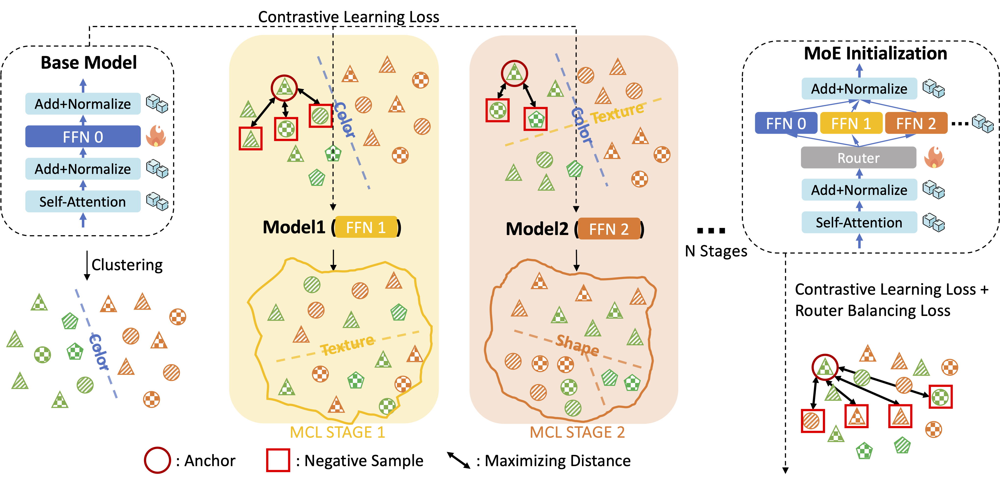

# CLIP-MoE: Towards Building Mixture of Experts for CLIP with Diversified Multiplet Upcycling
This is the official implementation of Diversified Multiplet Upcycling proposed in [*CLIP-MoE: Towards Building Mixture of Experts for CLIP with Diversified Multiplet Upcycling*]



## Set up
To get started, create and activate a Conda environment, 
```
conda install --yes -c pytorch pytorch=1.7.1 torchvision cudatoolkit=<your cuda version>
pip install ftfy regex tqdm
pip install git+https://github.com/openai/CLIP.git
cd CLIP-MoE
pip install -e .
```


## Evaluation

Here we provide the weights of the CLIP-MoE 4 experts with top-2 activation obtained from both ShareGPT4V and Recap-DataComp. The model weights are available on [Hugging Face](https://huggingface.co/MajorDavidZhang/CLIP-MoE/tree/main). Please download the weights. After that you can modify and use the evaluation scripts in `CLIP-MoE/eval`.

## Training

### Datasets
Please prepare [ShareGPT4V](https://github.com/ShareGPT4Omni/ShareGPT4V) or [Recap-DataComp](https://github.com/UCSC-VLAA/Recap-DataComp-1B). Notice that our code currently only support regular image folder datasets. If you are using `img2dataset` to prepare the data, please set `--output_format files` instead of `--output_format webdataset`. For Recap-DataComp we only need a small subset (around 1-10M samples) to demonstrate the performance improvement.

### Expert Extraction Using MCL
Multistage Contrastive Learning contains multiple iterations of training-clustering. To obtain a final CLIP-MoE with N experts, we need to perform N-1 stages of MCL.
#### Stage0
First, save the base model weights (e.g., OpenAI CLIP ViT-L-14):
```
srun --gres=gpu:8 python CLIP-MoE/train/train_mcl.py --epochs 0 --exp-name clip-mcl-s0
```
Which will save the base model weights to `CLIP-MoE/train/checkpoints` as `clip-mcl-s0_weights.pt`
Second, get the image and text representations of the whole training dataset:
```
srun --gres=gpu:8 python CLIP-MoE/train/inference.py --epochs 0 --exp-name clip-mcl-s0 --checkpoint-dir CLIP-MoE/train/checkpoints/clip-mcl-s0_weights.pt
```
Which will generate the representations into `CLIP-MoE/train/save_mcl_tmp/`, splitting by the number of gpus used.
Third, do clustering on the representations. Please set the parameters accordingly and run `CLIP-MoE/train/cluster.ipynb`. This will save the clustering results and pseudo_labels (the accumulated clustering results of all previous stages) for the next stage of MCL in `CLIP-MoE/train/save_mcl_tmp/clip-mcl_0_pseudo_labels.pt`
#### Stage1
Fine-tuning the base CLIP model according to the mcl pseudo labels, and freeze all parameters except the mlp layers:
```
srun --gres=gpu:8 python CLIP-MoE/train/train_mcl.py --epochs 1 --exp-name clip-mcl-s1 --MCL-label-path CLIP-MoE/train/save_mcl_tmp/clip-mcl_0_pseudo_labels.pt --lock-except-mlp
```
Then do the inference and clustering accordingly, and continue for N-1 stages.

### Initialization of CLIP-MOE and Continuous Fine-tuning
After expert extraction, we can use the obtained series of CLIP models with different mlp layers to build an MoE. First set the checkpoint list in line 26 of `CLIP-MoE/train/train_moe.py`. For example:
```
checkpoints=['CLIP-MoE/train/checkpoints/clip-mcl-s0_weights.pt',
    'CLIP-MoE/train/checkpoints/clip-mcl-s1_weights.pt',
    'CLIP-MoE/train/checkpoints/clip-mcl-s2_weights.pt',
    'CLIP-MoE/train/checkpoints/clip-mcl-s3_weights.pt']
```
Then, fine-tune the routers to get an optimized routing strategy. By defult we freeze all parameters except the routers. If you want to do large-scale continuous training, you can try different settings.
```
srun --gres=gpu:8 python CLIP-MoE/train/train_moe.py --epochs 1 --top-k 2 --lock-except-gate
```
This will optimize the routers with both CLIP loss and router balance loss, and finally save a CLIP-MoE model.


## Acknowledgement
- [Long-CLIP](https://github.com/beichenzbc/Long-CLIP) The codebase we built upon.
- [MCL](https://github.com/MajorDavidZhang/MCL) Original implementation of Multistage Contrastive Learning.